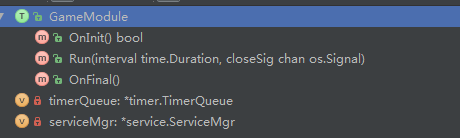

##服务框架 vendor/service
* govender
* docker linux 3.10
* etcd
* registrator
* etcd-browser

##功能
* 支持自动服务的注册和发现
* 支持服务负载均衡
* CP 一致性和分区容忍性
* 支持http 和 tcp
* 安全：TLS
* 可靠: etcd使用Raft适当分布


###Appliction 模块
* 基于Ioc 控制反转
* 游戏逻辑单goroutine 开发简单高效
* 类似Half Sync/Half Async模式 net timer ticker单独跑goroutine --通过chan mq--> main goroutine
* 游戏逻辑靠客户端Req和服务器Tick驱动
* TimerQueue timer ticker trans to main loop

###Usage
###Module 接口
```
type Module interface {
    OnInit() bool
    OnFinal()
    Run(interval time.Duration, closeSig chan os.Signal)
}
```
####GameSvr服

```

func main() {
    app := &module.Application{}
    GameModule := &GameModule{}

    app.Register(GameModule) //将GameModule 注册到app
    app.SetInterval(time.Second * DefaultInterval)
    app.Run()  //调用app.Run() 程序即进入MainLoop
}
```